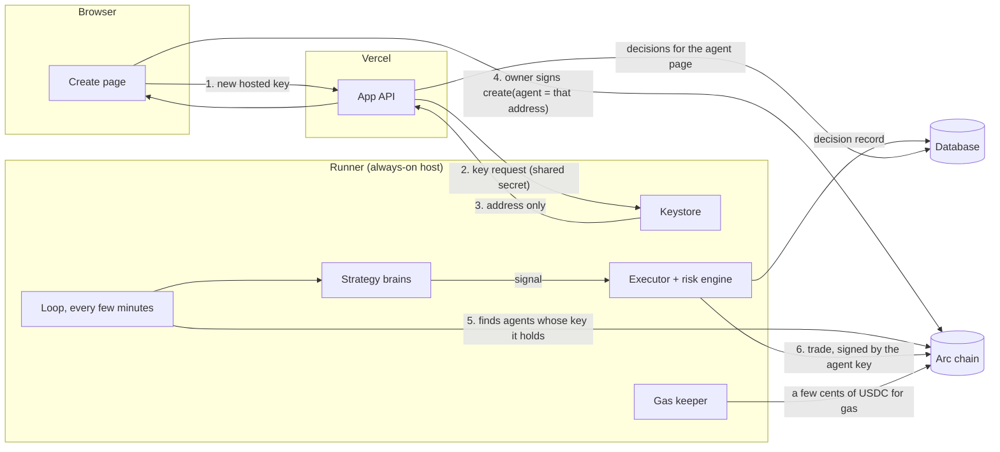

# Hosted agents: Reins runs the bot

*Sketch, 2026-10-02. Not built yet. The step-by-step build plan is [HOSTED-AGENTS-PLAN.md](HOSTED-AGENTS-PLAN.md).*

## Why

"Create an agent" today makes a funded contract with limits, and nothing trades
it until the owner runs a bot of their own. Most people won't. Hosting closes
that gap: you pick a strategy when you create the agent, and Reins holds its
trading key and runs it.

It is safe in a way hosted trading usually isn't, because of what the trading key
can't do:

| If the runner is compromised, the attacker can… | …and cannot |
|---|---|
| make trades inside each agent's limits | withdraw a cent: the key has no function that moves money out |
| make bad trades, until the stop-loss freezes the agent | trade past the per-trade cap, the price band or the stop-loss |
| | change any limit (they are fixed at creation) |
| | stop the owner from revoking the key or withdrawing everything |

The worst case is bounded by the owner's own stop-loss. That is the whole Reins
pitch, applied to ourselves.

## What the user sees

**Create page, step 3, "Who trades":**

1. **Let Reins run it** (default once this ships). Pick a strategy:
   - **Euro savings.** Buys a fixed amount of EURC on a schedule until a target share is reached, then holds.
   - **50/50 balance.** Keeps the agent near half USDC, half EURC, and trades back when the split drifts outside a band.
   - Template strategies appear here as **paper trading** until their assets list on Arc.
2. **Connect my own bot.** Paste a trading address, as today.
3. **Decide later.** No key yet, as today.

**Agent page:** "Run by Reins · 50/50 balance", the latest decisions in plain words
("Held: EURC is 48% of the agent, inside 45–55%"), and a **Pause** button. Pausing
revokes the key on-chain (`setAgent(0)`), which already exists on the page as
"Change or revoke the trading key".

## How it fits together



The app on Vercel never sees a private key. Keys are made, stored and used only
inside the runner.

## What's reused, what's new

| Piece | Status |
|---|---|
| Executor: one signal, at most one trade, inside the mandate's limits; never resends an unconfirmed trade | **exists**, `bridge/executor.js` |
| Risk engine: sells-only at half the loss budget, halts at 80%, per-asset cap | **exists**, `bridge/risk.js` |
| Signal shape (`buy`/`sell`/`hold`, reason) | **exists**, `bridge/signals.js` `fromDecision` |
| Symbol registry, shadow trades for unlisted assets | **exists**, `bridge/registry.js` |
| Agent SDK: status, price, trade | **exists**, `mandate/sdk.js` |
| Keystore: generate, encrypt, load trading keys | new |
| Brains: euro savings, 50/50 balance | new, small and pure, fully testable |
| Loop: which agents to run, when, with what | new |
| Gas keeper | new |
| Database for hosted agents and decisions (ledger.js has a file and memory store today) | new store behind the same interface |
| API: hosted key request, decisions per agent | new routes in `app/server.js` |
| Create page option and agent page decisions | new UI |

## The pieces in more detail

**Keystore.** One key per hosted agent, made with a secure random generator,
encrypted at rest with a master key held in the host's secret store, never
logged and never returned. The app asks for a key with a shared secret and gets
back only the address. A key that isn't used by a create transaction within a
day is discarded. Requests are rate-limited, so nobody can farm keys.

**Matching keys to agents.** The runner reads `MandateCreated` from the factory,
which it already knows how to do through the indexer and the snapshot. It also
reads `AgentChanged`. An agent is run only while its current agent address is a
key the runner holds. Revoking or replacing the key stops it on the next pass,
with no extra call to us.

**Brains.** Each one is a pure function: the agent's status in, a decision with a
reason out. No network calls. That makes each brain a set of plain unit tests.

```js
// 50/50 balance: trade back to the target when the split drifts outside the band.
decide({ equityUsd, holdings }, { target = 0.5, band = 0.05 }) // → { side, asset, sizeUsd, reason }
```

**Loop.** Every few minutes it goes through each hosted agent in turn: status,
then brain, then signal, then executor. The executor already applies the risk
engine and the contract's limits, and writes one record per decision. One agent
failing never stops the others. A global kill switch pauses everything.

**Gas.** Arc charges gas in USDC, about a cent a trade. The keeper keeps each
hosted key between $0.10 and $0.50 from a Reins gas wallet. At a few trades a
day per agent, that is a few dollars a year each. It's worth surfacing in the
product ("Reins pays the gas") rather than charging for it.

**Storage.** Two tables are enough to start:

- `hosted_agents`: mandate address, key address, encrypted key, strategy and its settings, created and paused times.
- `decisions`: mandate, time, outcome (traded, held, refused, risk, skipped), reason, rule, transaction hash.

SQLite on the host's disk is fine for the first version. Move to Postgres (Neon or
Supabase free tiers) if the runner ever needs more than one machine.

## Where it runs

It needs one always-on process, so Vercel's request-driven functions aren't a fit,
and its free scheduled jobs run once a day.

| Host | Fits | Cost |
|---|---|---|
| Railway | always-on Node service, secrets, a volume for SQLite | about $5/month |
| Fly.io | the same, plus a choice of regions | about $5/month |
| Render | the same; the free tier sleeps, so use the paid tier | about $7/month |

Any of them works. Railway is the least setup.

## What to watch

- **The runner is a hot wallet for trading keys only.** Treat the master key like
  one: in the host's secret store, rotated if anything looks wrong.
- **Testnet first.** On mainnet these are real people's strategies on real money.
  Running strategies for users, even without holding their funds, is the open
  "is this regulated?" question in [PRODUCT.md](PRODUCT.md). One conversation with
  a lawyer before mainnet.
- **Honest strategies.** On Arc today the only pair is USDC/EURC, and the euro
  reversion idea was measured and almost never fires
  ([research/FINDINGS.md](../research/FINDINGS.md)). Savings and rebalancing are
  plain, explainable and do what they say. The crypto templates stay as paper
  trading until their assets list.
- **Alerts.** A message to the owner when an agent reaches its sells-only line, and
  again if it freezes. It is plan item 14, and hosting makes it matter more.

## Build order

1. **Runner core, local, testnet** (2–3 days): keystore, the two brains with
   tests, the loop on top of the existing executor and risk engine, the decisions
   store, the gas keeper. Run it against a test agent on Arc testnet.
2. **Product surface** (1–2 days): the hosted-key route, "Let Reins run it" with
   the strategy choice on the create page, decisions and Pause on the agent page.
3. **Deploy** (half a day once a host is chosen): secrets, the database volume, a
   health check, and a kill switch.

## Decisions needed

1. **Host:** Railway, Fly.io or Render. Railway is the suggestion.
2. **Gas:** Reins pays, or the owner tops up. Paying is the suggestion; it's pennies.
3. **First strategies:** euro savings and 50/50 balance, or others.
4. **Default on the create page:** "Let Reins run it" as the default once it ships.
